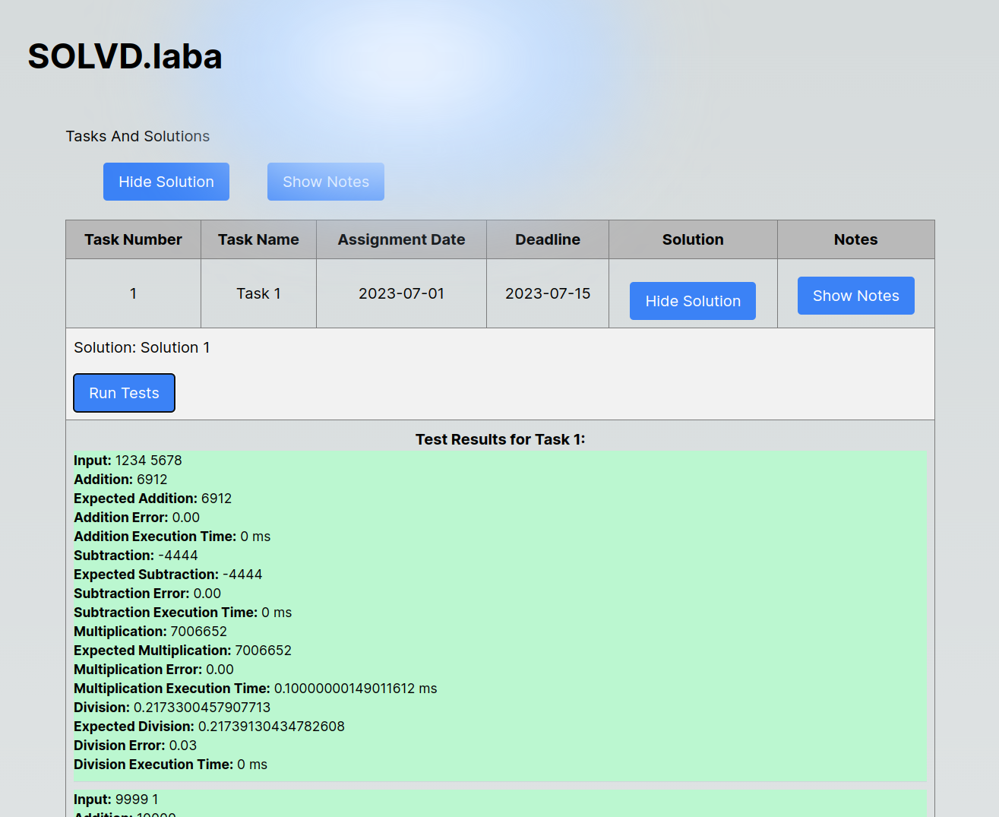

This is a [Next.js](https://nextjs.org/) project bootstrapped with [`create-next-app`](https://github.com/vercel/next.js/tree/canary/packages/create-next-app).


## Project Overview


## Getting Started

First, run the development server:

```bash
# (RECOMMENDED by A.V.!)
docker-compose up --build --force-recreate
# or
npm run dev
# or  (the project was not deployed with the yarn pm :( )
yarn dev
# or (the project was not deployed with the yarn pm)
pnpm dev

```

Open [http://localhost:3000](http://localhost:3000) with your browser to see the result(in case of modification the Dockerfile try another one).

You can start editing the page by modifying `app/page.tsx`. The page auto-updates as you edit the file.

This project uses [`next/font`](https://nextjs.org/docs/basic-features/font-optimization) to automatically optimize and load Inter, a custom Google Font.

## Learn More

This section was left blue with the direct author's intention

## Descrition (Breaf version)

The task implementation and the brief specification description (fullversion prepared for doxygen will be conducted far a bit latere) is inside the tasks directory, where it is also possible to find the testing set, results of which are printed in the table of the UI.

## Development Plan
Here are the main features included in the project:

- [x] User Interface developed with Next.js
- [ ] Connection to Judge0 API
- [ ] Mailer service for sending code results
- [ ] Future improvements and additions